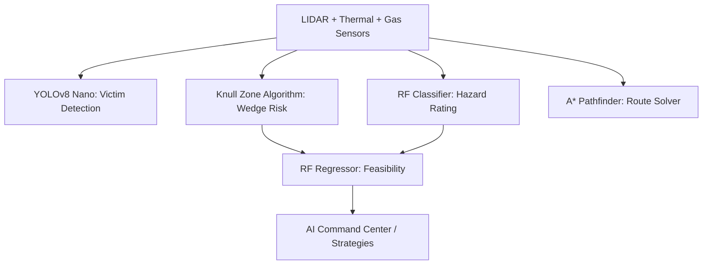

# SERP-X: Subterranean Extraction & Rescue Platform
### 🕸️ Knull Zone & Nutty Putty Cave Simulation Dashboard

SERP-X is an interactive, browser-based emergency rescue dashboard simulating a search-and-rescue operation in highly constrictive, hazardous cave systems (inspired by the layout and challenges of Utah's famous **Nutty Putty Cave**, including "The Birth Canal" and "The Squeeze"). 

The dashboard displays real-time telemetry from an autonomous snake-like robot (SERP-X) and leverages five specialized machine learning and heuristic models—highlighted by the **Knull Zone Algorithm**—to assess extraction safety and plot rescue paths.

---

## 📸 Dashboard Overview & Features

SERP-X features a sci-fi command-center aesthetic with high-performance real-time visualizations:
* **Live Cave Cross-Section**: Renders the cave geometry, robot position, debris collapses, thermal victim location, and LIDAR scanning animations.
* **A\* Pathfinding Grid**: A diagnostic sub-panel rendering the navigated node grid, obstacles, hazard costs, and the solved optimal path.
* **3D Tunnel Point Cloud**: An interactive canvas projecting the cave walls in a pseudo-3D perspective rotating in real-time.
* **Telemetry Monitors**: Physical metrics tracking tunnel width/height, air quality ($O_2$), victim head-down slope angle, and hazardous gases ($CO$ and $CH_4$).
* **AI Command Recommendation**: Generates structural advisories and calculates confidence scores based on simulated sensor feeds.
* **Rescue Strategy Ledger**: Dynamically outputs actionable options (e.g. *Hydraulic Expansion*, *Secondary Staging*, *Gas Purge*) once the exploration phase completes.

---

## 🧮 Algorithm Architecture

The system coordinates five core algorithms executing across different phases of the exploration run:



### 1. The Knull Zone Algorithm (Wedge Prediction)
The **Knull Zone Algorithm** is a spatial clearance model. It computes the physical risk of an operator or victim getting wedged or trapped within sub-shoulder passages, named after the concept of a "Knull Zone" (representing a boundary of absolute spatial entrapment from which backing out is geometrically impossible).

* **Math Model**:
  * **Clearances**: Calculates lateral ($C_w$) and vertical ($C_h$) margins against standard adult human frames (Shoulders: $45.7\text{ cm}$, Chest: $25.4\text{ cm}$).
  * **Gravity Vector**: Projects the slope angle using a non-linear trigonometric multiplier: $2 \times \sin^{1.5}(\theta)$.
  * **Compression Coefficient**: Amplifies risk rapidly if passage width drops below shoulder width ($W_{tunnel} < W_{shoulder}$).
* **Multi-Language Support**:
  * **JavaScript Implementation**: [knull_zone_algorithm.js](file:///c:/Users/Hrishikesh%20Jha/Desktop/serp/Knull%20Zone%20Algorithm/knull_zone_algorithm.js) (drives the dashboard canvas and gauges).
  * **Python Implementation**: [knull_zone_algorithm.py](file:///c:/Users/Hrishikesh%20Jha/Desktop/serp/Knull%20Zone%20Algorithm/knull_zone_algorithm.py) (includes test suites for off-line CLI analysis).
* See the [Knull Zone README](file:///c:/Users/Hrishikesh%20Jha/Desktop/serp/Knull%20Zone%20Algorithm/README.md) for full formulas.

### 2. YOLOv8 Nano (Simulated Object Detection)
A light-weight neural network model (simulating a 3.2M parameter CSPDarknet architecture) running client-side.
* **Function**: Analyzes thermal infrared camera frames and distance values.
* **Classes**: Detects `person`, `helmet`, `body_part`, `equipment`, and `debris`.
* **Heuristics**: Runs simulated **Non-Maximum Suppression (NMS)** based on Intersection-over-Union (IoU) scores to prune overlapping bounding boxes.

### 3. Random Forest Classifier (Hazard Classification)
An ensemble of 50 decision trees running on a custom feature set:
* **Features**: Width, height, slope angle, air quality index, rock stability, and water level.
* **Output**: Categorizes the current cave sector into `SAFE`, `CAUTION`, or `DANGER`.
* **Ensemble Voting**: Uses a custom composite risk bias to weight the tree votes.

### 4. A\* Pathfinding (Rescue Route Solver)
A discrete grid navigator optimizing path safety and length:
* **Grid Resolution**: Maps the cave corridor onto a 40 (rows) $\times$ 60 (columns) navigable grid.
* **Cost Function**: Assigns higher navigation costs to cells adjacent to rock walls, water hazards, or gas pockets.
* **Heuristic**: Uses a weighted horizontal-biased Euclidean distance to encourage straight-line rescue corridors.

### 5. Random Forest Regressor (Extraction Feasibility)
An ensemble of 100 regression trees predicting the overall probability of a successful rescue:
* **Features**: Passageway clearance, Knull Zone wedge risk, slope, and hazard index.
* **Output**: A probability percentage (0 - 100%) and a 95% confidence interval ($\mu \pm 1.96\sigma$) indicating prediction variance across trees.

---

## 📂 Project Directory Structure

```
serp/
├── Knull Zone Algorithm/
│   ├── README.md               # Math, equations, and code walkthroughs for Wedge/Knull Model
│   ├── knull_zone_algorithm.js # JavaScript class implementation
│   └── knull_zone_algorithm.py # Standalone Python implementation with testing suite
├── index.html                  # Dashboard HTML UI structure
├── style.css                   # Cyberpunk Command Center stylesheet (CSS Grid, Animations)
├── script.js                   # Simulation loop, canvas renderers, and telemetry logic
├── algorithms.js               # ML model implementations (YOLOv8, RF, A*, Wedge)
├── package-lock.json           # Local npm metadata
└── README.md                   # Main documentation (this file)
```

---

## 🚀 How to Run the Dashboard Locally

Since the application is built using pure JavaScript, HTML5, and vanilla CSS, there are no heavy framework dependencies or build pipelines required. 

### Method 1: Direct Browser Launch
1. Clone this repository or download the source files.
2. Double-click [index.html](file:///c:/Users/Hrishikesh%20Jha/Desktop/serp/index.html) or open it inside any modern web browser (Chrome, Firefox, Edge, Safari).

### Method 2: Local Web Server (Recommended)
To prevent potential CORS warnings when loading assets or local scripts, run a local development server:
```bash
# Using Node.js (npx)
npx http-server ./

# Using Python
python -m http.server 8000
```
Then navigate to `http://localhost:8000` or the port displayed in your terminal.

---

## 🛠️ Development & Customizations
* **Modifying Cave Geometry**: Change segment definitions inside `generateCave()` in [script.js](file:///c:/Users/Hrishikesh%20Jha/Desktop/serp/script.js) to model new cave structures.
* **Tuning ML Classifiers**: The decision boundaries of the Random Forest models can be adjusted by editing splits in `DecisionTree` and `RFRegressorTree` inside [algorithms.js](file:///c:/Users/Hrishikesh%20Jha/Desktop/serp/algorithms.js).
* **Git Repository**: Linked to [https://github.com/hrishikeshjh/KnullZone.git](https://github.com/hrishikeshjh/KnullZone.git).
